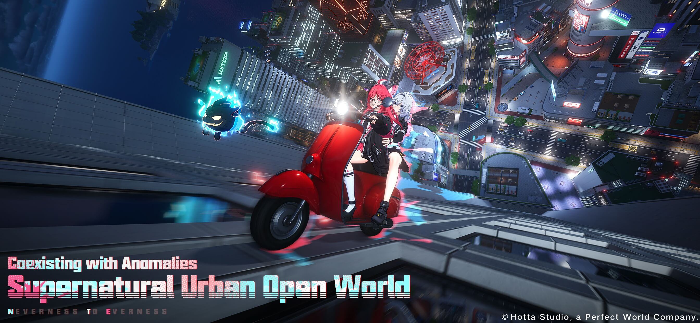

# **Panduan Lengkap Neverness to Everness (NTE)**

{width="6.5in" height="3.00334864391951in"}

Official key art source: nte.perfectworld.com (Hotta Studio / Perfect
World).

**Terakhir diriset: 5 Mei 2026**\
**Terakhir diubah: 5 Mei 2026, 20:55 WIB**\
Konteks patch: global launch/version 1.0, minggu rilis. Meta NTE masih
super muda, jadi jangan anggap guide ini kitab suci. Dokumen ini akan
diperbarui seiring perubahan data, banner, code, dan meta; cek secara
berkala sebelum ambil keputusan pull/build.

+-----------------------------------------------------------------------+
| **Quick Read**                                                        |
|                                                                       |
| **Mulai dari TL;DR kalau lo cuma butuh keputusan pull cepat. Lompat   |
| ke Build/Stats kalau lo lagi ngurus gear, skill, dan Awakening.**     |
+=======================================================================+
+-----------------------------------------------------------------------+

+-----------------------------------------------------------------------+
| **Tentang Dokumen**                                                   |
|                                                                       |
| Dokumen ini dibuat untuk mempermudah guide Neverness to Everness yang |
| dikumpulkan dari web, komunitas, dan media sosial, lalu dirapikan     |
| jadi satu panduan Indonesia yang lebih enak dibaca. Made by           |
| Papah-Chan, dibantu oleh Codex AI.                                    |
|                                                                       |
| Catatan update: versi ini akan terus disesuaikan jika ada perubahan   |
| patch, banner, redeem code, tier, team, atau info komunitas yang      |
| lebih akurat. Cek berkala biar lo nggak pakai info basi.              |
+=======================================================================+
+-----------------------------------------------------------------------+

## **Daftar Isi**

> Sumber Utama
>
> 0\. One-page Cheat Sheet
>
> 1\. TL;DR
>
> 2\. NTE Itu Tentang Apa?
>
> 3\. Alur Awal Game
>
> 4\. Guide Pemula
>
> 5\. Pull Guide: Current dan Upcoming
>
> 6\. Tier List Karakter dan Alasannya
>
> 7\. Line-up Terbaik dan Rotasi
>
> 8\. Build, Stats, dan Awakening Priority
>
> 9\. Redeem Code
>
> 10\. Selector dan Reroll Advice
>
> 11\. Prioritas Upgrade Praktis
>
> 12\. Rekomendasi Akhir
>
> 13\. Update Checklist

## **0. One-page Cheat Sheet**

+-----------------------------------------------------------------------+
| **Baca ini kalau lo cuma punya 60 detik**                             |
|                                                                       |
| Cheat sheet ini buat keputusan cepat. Detail reasoning, sumber, dan   |
| catatan risiko tetap ada di section lengkap setelahnya.               |
+=======================================================================+
+-----------------------------------------------------------------------+

  -----------------------------------------------------------------------
  **Topik**                           **Jawaban cepat**
  ----------------------------------- -----------------------------------
  Current limited                     Nanally: T0 Anima on-field DPS.
                                      Pull kalau butuh carry kuat
                                      sekarang.

  Standard selector aman              Sakiri / Daffodil / Jiuyuan. Pilih
                                      sesuai roster dan role yang bolong.

  Free/raise priority                 Zero, Haniel, Chiz, lalu unit yang
                                      nutup kebutuhan team lo.

  Team pemula nyaman                  Nanally + Zero + Haniel + Adler.
                                      Replace slot comfort kalau dapat
                                      Sakiri/Jiuyuan/Daffodil.

  Build rule                          Main stat benar dulu; substat
                                      perfect belakangan. Jangan buang
                                      resource early.

  Skill rule                          Ikuti Skill Priority dari kiri ke
                                      kanan. Tanda = artinya setara.

  Awakening rule                      Pilih efek prioritas tertinggi yang
                                      tersedia; A6 tidak otomatis harus
                                      nunggu A1-A5.

  Redeem code                         Claim semua code section 9
                                      secepatnya, terutama code
                                      launch-window.

  Meta warning                        Patch 1.0 masih muda. Cek update
                                      setelah Hotori/Lacrimosa live
                                      testing.

  Arc fallback                        Harus sesuai Arc type karakter.
                                      Kalau best Arc belum ada, pilih
                                      stat/passive yang cocok:
                                      Crit/ATK/DMG untuk DPS,
                                      Charge/utility untuk support,
                                      HP/DEF untuk survival.

  Cartridge fallback                  Elemental set untuk damage dealer;
                                      Speedy Hedgehog/utility untuk
                                      support; HP/DEF/healing set untuk
                                      survival. Main stat benar dulu, set
                                      perfect nanti.
  -----------------------------------------------------------------------

## **Sumber Utama**

-   Official NTE launch/news page:
    <https://nte.perfectworld.com/en/article/news/gamenews/20260226/261061.html>

-   PlayStation Blog gameplay overview:
    <https://blog.playstation.com/2026/04/20/nte-neverness-to-everness-out-april-29-new-gameplay-details-revealed/>

-   Prydwen NTE tier, team, character build, beginner/gacha guide:
    <https://www.prydwen.gg/neverness-to-everness/>

Prydwen Arc list dan character build pages untuk urutan Arc alternatif:
https://www.prydwen.gg/neverness-to-everness/arcs

Prydwen Cartridge/module guide untuk rule gear dan set bonus:
https://www.prydwen.gg/neverness-to-everness/guides/modules-cartridge/

AllThingsHow Arc overview untuk rule Arc type dan stat fallback:
https://allthings.how/every-arc-in-neverness-to-everness-stats-substats-and-passive-effects/

Community scan: r/NevernessToEverness, official social/X/Discord, dan
YouTube guide dipakai sebagai watchlist rumor/tips, tapi tetap harus
diverifikasi dengan official/in-game/Prydwen sebelum masuk rekomendasi
utama.

-   PC Gamer tier/upcoming characters:
    <https://www.pcgamer.com/games/action/neverness-to-everness-tier-list-best-characters/>

-   AllThingsHow banner schedule/gacha quick data:
    <https://allthings.how/neverness-to-everness-1-0-banners-nanally-and-hotori-schedule-rates-and-pulls/>

-   Cross-check redeem code: GamesRadar, PC Gamer, Icy Veins, GameWith.

## **1. TL;DR** {#tldr .unnumbered}

+-----------------------------------------------------------------------+
| **Best starting point**                                               |
|                                                                       |
| **Kalau lo cuma mau keputusan cepat: Nanally/Sakiri/Jiuyuan/Daffodil  |
| adalah core pembahasan utama launch 1.0.**                            |
+=======================================================================+
+-----------------------------------------------------------------------+

NTE adalah free-to-play supernatural urban open-world action RPG dari
Hotta Studio/Perfect World. Vibenya: open city anime, supernatural case,
kendaraan, job, shop, housing, property/business system, dan gacha team
combat. Lo main sebagai Appraiser/Anomaly Hunter tidak berlisensi
pertama di kota Hethereau, lalu kerja bareng Eibon, toko antik yang
ngambil commission buat ngurus anomaly.

Pull/value paling penting sekarang:

-   Current limited: Nanally. T0 Anima on-field DPS, kuat buat sustained
    damage, AoE, grouping, dan follow-up. Pull kalau lo butuh carry kuat
    sekarang.

-   Next confirmed 1.0 banner: Hotori, 13 Mei-3 Juni 2026. S-class
    Cosmos/Solid burst DPS dengan kit time-stop style. Kelihatan kuat,
    tapi kalau lo min-max, tunggu 24-48 jam setelah rilis biar angka
    finalnya kebaca.

-   Next-patch hype: Lacrimosa. Belum playable di launch. PC Gamer
    mencatat versi beta Lacrimosa adalah Chaos/Liquid DPS, tapi final
    kit bisa berubah. Save kalau lo suka dia atau mau future Chaos
    coverage.

-   Target selector standard paling aman: Sakiri, Daffodil, Jiuyuan.
    Fadia dan Hathor bagus, tapi lebih tergantung roster/team.

-   Free/raise priority: Zero, Haniel, Chiz, lalu unit yang nutup
    kebutuhan team lo.

Jangan panic pull semua banner kayak orang dikejar debt collector gacha.
Build satu team bagus dulu, baru pikir team kedua.

## **2. NTE Itu Tentang Apa?**

NTE berlatar di Hethereau, kota di mana anomaly dan hal-hal supernatural
sudah jadi bagian kehidupan sehari-hari. Dari official launch page,
story dimulai saat lo menjadi Anomaly Hunter tidak berlisensi pertama
dan bergabung dengan Eibon, toko antik yang bertahan hidup lewat anomaly
commissions dari warga.

Vibenya bukan langsung \"selamatkan dunia atau tamat\" dari menit
pertama. Lebih ke urban mystery episodic:

-   Investigasi kejadian supernatural.

-   Ketemu warga, Esper, dan anomaly aneh.

-   Keliling kota, nyetir, kerja job, urus business/property, fishing,
    > mahjong, racing, dan side activity lain.

-   Build team berdasarkan attribute dan Esper Cycle buat
    > combat/endgame.

Inti game-nya:

-   Hunt anomaly.

-   Explore Hethereau.

-   Bangun life/business di kota.

-   Pull dan build karakter.

-   Push endgame seperti Beyond the Rails dan High Risk Commission.

PlayStation Blog juga nunjukin NTE bakal berat di city-life system: City
Tycoon, co-op stage seperti Pink Paws Heist dan Coldmount Hospital,
hangout/move-in, first-person perspective, musik Persona 5 di launch,
dan collab Porsche di update mendatang.

## **3. Alur Awal Game**

Secara praktis, early game NTE biasanya begini:

-   Selesaikan prologue/tutorial.

-   Unlock phone menu dan mailbox.

-   Redeem semua code aktif.

-   Claim mail launch/pre-registration.

-   Push main story sampai core system kebuka.

-   Mulai bentuk satu team fungsional.

-   Pakai stamina/resource harian.

-   Kerjakan City Tycoon dan exploration pelan-pelan.

Jangan langsung ngejar gear perfect hari pertama. Early game lebih
penting buat unlock system, kumpulin resource, dan nentuin carry/support
pertama.

## **4. Guide Pemula**

+-----------------------------------------------------------------------+
| **Resource sanity check**                                             |
|                                                                       |
| **Early game fokus unlock system dan satu team fungsional dulu.       |
| Gear/substat perfect itu urusan nanti, jangan jadi badut stamina.**   |
+=======================================================================+
+-----------------------------------------------------------------------+

### **Checklist hari pertama**

-   Finish prologue sampai mail dan redeem code kebuka.

-   Redeem semua code di section 9.

-   Pull standard banner secukupnya buat mendekati/claim 50-pull
    selector, tapi jangan buru-buru pakai selector kalau lo masih ngejar
    Nanally/Hotori.

-   Tentukan archetype team pertama.

-   Level satu main DPS dulu, lalu support utama, lalu cycle/flex unit.

-   Pakai Character Pixels harian buat material character/skill.

-   Equip Cartridge dengan main stat yang bener dulu; substat perfect
    > urusan nanti.

### **Basic gacha** {#basic-gacha .unnumbered}

Sistem gacha NTE lumayan ramah dibanding banyak gacha lain:

-   Limited banner tidak punya 50/50. Kalau kena featured S-class, ya
    > dapat featured unit.

-   Soft pity mulai setelah 70 pull.

-   Hard pity di 90 pull.

-   Limited pity carry ke limited board berikutnya.

-   Weapon/Arc banner pakai Tri-Key, currency terpisah, dan punya
    > guarantee sendiri.

-   Standard banner punya one-time 50-pull S-class selector.

Saran pemula: character lebih penting daripada signature Arc. Pull
signature Arc cuma karena \"drip\" itu cara paling cepat bikin Annulith
lo cooked.

### **Basic team building**

Guide team-building Prydwen menyarankan team aman berisi:

-   1-2 Damage unit.

-   1-2 Buff unit.

-   0-1 Survival unit.

Survival itu optional kalau dodge/parry lo rapi, tapi pemula tidak perlu
malu pakai shield/heal. DPS mati itu damage-nya nol. Shocking banget ya.

### **Basic combat**

Hal yang wajib lo pahami:

-   Dodge rapi buat trigger Critical Riposte.

-   Parry kalau indikator ring pas.

-   Bangun Cycle Gauge.

-   Swap karakter buat trigger Esper Cycle.

-   Setup buff/debuff sebelum damage window carry.

-   Jangan kelamaan pakai support di field kalau kit-nya tidak butuh.

Pola rotasi umum:

-   Pakai buff/debuff support.

-   Apply attribute yang dibutuhkan buat Esper Cycle.

-   Trigger reaction yang dituju.

-   Swap ke carry.

-   Pakai Skill/Ultimate/burst window carry.

-   Ulang saat buff/cycle habis.

## **5. Pull Guide: Current dan Upcoming** {#pull-guide-current-dan-upcoming .unnumbered}

### **Nanally**

Banner: 29 April-13 Mei 2026\
Role: S-class Anima DPS, Plasma Arc.\
Pull value: tinggi.

Kenapa bagus:

-   T0 di Prydwen character tier.

-   Sustained on-field damage kuat.

-   Follow-up attack kit bagus buat scaling dengan buff/cycle.

-   Cocok dengan Jiuyuan/Blossom dan support core.

-   Exploration perk: bisa jalan di dinding/langit-langit saat special
    > state.

Alasan skip:

-   Butuh field time.

-   Kalau lo tidak suka sustained on-field carry.

-   Kalau lo save buat Hotori atau Lacrimosa dan cuma mau satu limited
    > dekat-dekat ini.

Verdict: worth pull buat kebanyakan account yang butuh power sekarang.

### **Hotori**

Banner: 13 Mei-3 Juni 2026, berdasarkan schedule 1.0 yang beredar.\
Role: S-class Cosmos/Solid burst DPS dengan time-stop/Momentum style
kit.\
Pull value: kemungkinan tinggi, tapi tunggu final testing.

Kenapa terlihat valuable:

-   Confirmed next limited setelah Nanally.

-   Kit Cosmos burst/time-stop bisa kuat buat boss window.

-   PC Gamer menyebut dia juga punya team damage boost.

Alasan tunggu:

-   Angka final dan live testing tetap penting.

-   Kalau Nanally sudah cukup buat clear, mungkin lebih worth save buat
    > Lacrimosa.

Verdict: belum bisa disebut wajib. Strong candidate, tapi tunggu day-one
testing.

### **Lacrimosa**

Status: belum tersedia di launch.\
PC Gamer mencatat Lacrimosa playable di beta sebelumnya dan kemungkinan
jadi limited version 1.1 karena drip marketing. Beta info: Chaos/Liquid
DPS. Ini bisa berubah.

Kenapa penting:

-   Daffodil adalah satu-satunya Chaos character di 1.0.

-   Tambahan Chaos unit bisa buka/improve reaction coverage.

-   Kalau Lacrimosa jadi Chaos DPS kuat, meta team bisa geser.

Verdict: save kalau lo suka design-nya atau mau future Chaos coverage.
Jangan final \"must pull\" sebelum official kit.

## **6. Tier List Karakter dan Alasannya**

Basis tier: Prydwen 1.0 endgame tier list, cross-check dengan PC
Gamer/Dexerto-style launch tier. Fokus tier ini lebih ke Beyond the
Rails/High Risk Commission, bukan story casual.

  ----------------------------------------------------------------------------------
  **Character**   **Tier**   **Alasan**
  --------------- ---------- -------------------------------------------------------
  Nanally         T0         Top Anima on-field DPS. Follow-up burst window kuat,
                             AoE/grouping value, cocok dengan Blossom/Hex core.

  Sakiri          T0         Support terbaik launch. Buff, DEF shred, DoT/Scorch/Hex
                             value, dan A4 jadi power spike support besar.

  Haniel          T0         Free A-rank support dengan ATK/off-field value tinggi
                             dan synergy Speedy Hedgehog. Account value gila.

  Zero            T0         MC fleksibel, hybrid/cycle utility kuat, makin bagus
                             saat awakening kebuka.

  Daffodil        T0.5       Satu-satunya Chaos unit 1.0, enabler
                             Discord/Scorch/Nova, Break value kuat. Spike besar
                             dengan A3+A5 style investment.

  Baicang         T0.5       Incantation DPS kuat, bagus di Scorch/DoT team, ceiling
                             tinggi kalau dimainkan rapi.

  Chiz            T0.5       Free S-class lewat Tycoon progression. Kuat, tapi butuh
                             perhatian lebih. Value tinggi karena copy gratis.

  Hathor          T0.5       Lakshana hybrid/buffer, bagus buat Charge/Remora/Stain
                             setup dan hypercarry shell.

  Jiuyuan         T0.5       Account value tinggi: off-field Anima damage, grouping,
                             Blossom/Vita Bud value, dan A2 healing utility.

  Fadia           T1         Defensive Psyche/Synthesis unit. HP redirect/survival
                             utility makin kerasa di hard content. Bagus tapi
                             team-specific.

  Aurelia         T1         A-rank Psyche DPS, Nova-friendly dan playable, tapi
                             ceiling di bawah carry top.

  Adler           T1         A-rank shielder/survival dengan Incantation utility.
                             Budget piece bagus buat Scorch/Hex dan safe play.

  Mint            T2         Free early Anima DPS. Usable, tapi ke-outclass oleh
                             Nanally/Jiuyuan core.

  Skia            T2         Lakshana DPS dengan Stain/Remora team. Bisa jalan, tapi
                             bukan investasi top kecuali lo suka dia.

  Edgar           T3         Healer comfort, tapi team value kalah dari
                             shield/buff/off-field damage. Dipakai kalau butuh aman.
  ----------------------------------------------------------------------------------

## **7. Line-up Terbaik dan Rotasi**

Data team basisnya dari Prydwen team tier list dan character pages.
Beberapa team punya flex slot/variant, jadi pakai konsep \"core + flex\"
kalau karakter lo belum lengkap.

### **T0: Nanally Hyper**

Core: Nanally + Sakiri + Jiuyuan + Zero\
Flex/variant: Haniel atau Adler kalau butuh buff/safety yang lebih
gampang.

Kenapa bagus:

-   Nanally jadi main damage window.

-   Sakiri kasih buff dan Incantation/Hex utility.

-   Jiuyuan kasih Blossom/off-field output dan grouping.

-   Zero kasih instant cycle dan setup reaction fleksibel.

Rotasi simpel:

-   Zero Skill/utility buat prep Cycle Gauge.

-   Sakiri Ultimate buat buff/debuff.

-   Jiuyuan setup buat off-field/Blossom value.

-   Nanally Skill.

-   Nanally Ultimate.

-   Stay di Nanally buat normal/heavy follow-up window.

-   Ulang support setup saat buff/cycle habis.

### **T0: Baicang Firefly/Scorch Hyper** {#t0-baicang-fireflyscorch-hyper .unnumbered}

Core: Baicang + Sakiri + Jiuyuan + Daffodil

Kenapa bagus:

-   Baicang jadi engine damage Incantation utama.

-   Sakiri buff dan menguatkan DoT/Incantation playstyle.

-   Daffodil kasih Chaos coverage dan Break/Discord/Scorch enabling.

-   Jiuyuan menambah Anima/off-field utility dan reaction coverage.

Rotasi simpel:

-   Sakiri buff/debuff.

-   Daffodil apply Chaos/Break pressure.

-   Jiuyuan setup.

-   Baicang Skill stacking.

-   Baicang Ultimate/burst.

-   Cycle Daffodil/Sakiri/Baicang buat maintain Scorch/Discord pressure.

### **T0: Chiz Hyper** {#t0-chiz-hyper .unnumbered}

Core: Chiz + Jiuyuan + Hathor + Haniel atau Zero

Kenapa bagus:

-   Chiz adalah free S-class DPS yang scaling-nya kuat.

-   Hathor enable Charge/Remora/Stain.

-   Jiuyuan bantu off-field pressure dan Blossom.

-   Haniel/Zero bikin buff dan Cycle lebih konsisten.

Rotasi simpel:

-   Haniel atau Zero setup.

-   Jiuyuan setup.

-   Hathor Skill/Ultimate buat prep Remora/Charge/Stain window.

-   Chiz Skill/Ultimate sambil manage Grain/Fons.

-   Ulang di damage window Chiz.

### **T0: Daffodil Break A2+** {#t0-daffodil-break-a2 .unnumbered}

Core: Daffodil + Sakiri + Baicang + Haniel

Kenapa bagus:

-   Break value Daffodil naik besar dengan key awakening.

-   Sakiri/Baicang kasih Incantation/Scorch shell.

-   Haniel kasih buff dan throughput team.

Rotasi simpel:

-   Haniel buff.

-   Sakiri buff/debuff.

-   Baicang apply Incantation/DoT pressure.

-   Daffodil masuk buat Break/Chaos window.

-   Ulang berdasarkan support skill dan Break uptime Daffodil.

### **T0.5: Hathor Hyper** {#t0.5-hathor-hyper .unnumbered}

Core: Hathor + Haniel + Zero + Jiuyuan

Kenapa bagus:

-   Charge/Remora/Stain sequencing kuat.

-   Haniel boost field unit.

-   Zero/Jiuyuan kasih cycle flexibility dan off-field help.

Rotasi simpel:

-   Trigger Blossom dulu kalau bisa.

-   Setup Stain.

-   Trigger Remora/Charge.

-   Field Hathor selama buffed window.

-   Kalau Hathor tidak butuh energy, pakai Charge buat refill Haniel.

### **T0.5: Nanally F2P/Budget** {#t0.5-nanally-f2pbudget .unnumbered}

Core: Nanally + Zero + Haniel + Adler\
Flex: Daffodil kalau punya dan butuh reaction coverage.

Kenapa bagus:

-   Pakai unit accessible/free-friendly.

-   Haniel buff, Adler shield, Zero cycle, Nanally carry.

-   Nyaman buat pemula tanpa perlu execution sempurna.

Rotasi simpel:

-   Adler shield kalau butuh aman.

-   Haniel buff.

-   Zero cycle setup.

-   Nanally Skill -\> Ultimate -\> on-field damage.

### **T1: Aurelia Hyper** {#t1-aurelia-hyper .unnumbered}

Core: Aurelia + Hathor + Zero + Jiuyuan

Kenapa bagus:

-   Aurelia suka Nova/Psyche setup.

-   Hathor/Zero/Jiuyuan kasih reaction dan energy support.

Rotasi simpel:

-   Zero/Jiuyuan setup.

-   Hathor setup Remora/Stain/Charge.

-   Aurelia Skill, lanjut jellyfish/basic play.

-   Ultimate saat tersedia.

### **T2: Mint Hyper** {#t2-mint-hyper .unnumbered}

Core: Mint + Sakiri + Jiuyuan + Zero

Kenapa bagus:

-   Team AoE/early yang accessible.

-   Hex/Blossom bantu nutup ceiling Mint yang lebih rendah.

Rotasi simpel:

-   Sakiri buff.

-   Jiuyuan setup.

-   Zero cycle.

-   Mint on-field Skill/basic window.

### **T2: Skia Hyper** {#t2-skia-hyper .unnumbered}

Core: Skia + Haniel + Zero + Jiuyuan

Kenapa bagus:

-   Stain/Remora shell buff damage marked-target Skia.

-   Haniel dan Zero bikin rotasi lebih smooth.

Rotasi simpel:

-   Haniel buff.

-   Zero/Jiuyuan setup.

-   Trigger Stain, lalu Remora/Charge kalau tersedia.

-   Skia field time selama mark/buff window.

## **8. Build, Stats, dan Awakening Priority** {#build-stats-dan-awakening-priority .unnumbered}

+-----------------------------------------------------------------------+
| **Cara pakai section ini**                                            |
|                                                                       |
| **Pakai Main Stats buat memilih gear utama, Substats buat sorting     |
| gear bagus, Skill Priority buat urutan upgrade, dan Awakening buat    |
| memilih efek dupe yang dipasang dulu.**                               |
+=======================================================================+
+-----------------------------------------------------------------------+

Table ini merangkum character page Prydwen patch 1.0. Untuk A-rank,
anggap lama-lama lo bakal punya semua awakening; order ini cuma
prioritas aktivasi duluan.

### **Arc dan Cartridge**

  ------------------------------------------------------------------------------------
  **Character**   **Attr/Role/Arc   **Tier**   **Recommended       **Recommended
                  Type**                       Arcs**              Cartridge**
  --------------- ----------------- ---------- ------------------- -------------------
  Adler           Incantation /     T1         Umbrella; The Great Kingdom\'s Guard;
                  Survival /                   Thief               Speedy Hedgehog
                  Synthesis                                        

  Aurelia         Psyche / Damage / T1         Ready-Ready;        Devil\'s Blood:
                  Plasma                       Stellar Veil; Fluff Curse; Lost
                                               of Fortitude        Radiance; Shadow
                                                                   Creed

  Baicang         Incantation /     T0.5       Camellia Society; A Crimson: Twin
                  Damage /                     Time Will Come      Butterflies; Shadow
                  Synthesis                                        Creed

  Chiz            Cosmos / Damage / T0.5       Contemplative Cat   Lost Radiance;
                  Gas                                              Shadow Creed

  Daffodil        Chaos / Damage /  T0.5       Youthful Fantasy;   Diabolos
                  Liquid                       Fluff of Fleetness; 
                                               Shiny Days          

  Edgar           Cosmos / Survival T3         Call of the Twisted Thea\'s Night
                  / Liquid                     City; Mind Royale   Tavern; Speedy
                                                                   Hedgehog

  Fadia           Psyche / Survival T1         Eternal Waltz; The  Tiny Big Adventure;
                  / Synthesis                  Great Thief         Quiet Manor

  Haniel          Psyche / Buff /   T0         Blow up the Crowd;  Speedy Hedgehog;
                  Solid                        Hethereau\'s        Fireflies and the
                                               Keeper; Day Off     Forest

  Hathor          Lakshana / Buff / T0.5       Raging Flames;      Street Boxer;
                  Plasma                       Fluff of Fortitude; Devil\'s Blood:
                                               Song of the Whale   Curse

  Jiuyuan         Anima / Damage /  T0.5       Reality Refuge;     Fireflies and the
                  Solid                        Fluff of            Forest; Devil\'s
                                               Fearlessness;       Blood: Curse
                                               Hethereau\'s Keeper 

  Mint            Anima / Damage /  T2         Fluff of Fleetness; Fireflies and the
                  Liquid                       Mind Royale; Shiny  Forest; Shadow
                                               Days                Creed

  Nanally         Anima / Damage /  T0         Ready-Ready; Fluff  Fireflies and the
                  Plasma                       of Fortitude;       Forest; Shadow
                                               Raging Flames       Creed; Lost
                                                                   Radiance

  Sakiri          Incantation /     T0         Good Boy\'s Grand   Speedy Hedgehog;
                  Buff / Gas                   Adventure           Crimson: Twin
                                                                   Butterflies

  Skia            Lakshana / Damage T2         Watch Your Heads!   Street Boxer;
                  / Gas                                            Shadow Creed

  Zero            Cosmos /          T0         Day Off; Fluff of   Speedy Hedgehog;
                  Damage/Hybrid /              Fearlessness; The   Lost Radiance;
                  Solid                        Rain That Shook the Fireflies and the
                                               World               Forest
  ------------------------------------------------------------------------------------

### **Alternatif Arc dan Cartridge kalau belum punya best-in-slot**

Rule cepat: Arc wajib cocok dengan Arc type karakter. Kalau tidak punya
rekomendasi utama, jangan asal equip rarity tinggi yang salah type.
Untuk Cartridge, pakai set dan main stat yang masuk akal dulu; perfect
set/substat bisa dikejar nanti.

### Fallback damage / flex units

  ---------------------------------------------------------------------------------------
  **Character**     **Arc fallback    **Cartridge fallback**      **Catatan pakai**
                    kalau best belum                              
                    ada**                                         
  ----------------- ----------------- --------------------------- -----------------------
  Aurelia           Ready-Ready \>    Devil\'s Blood: Curse \>    Psyche DPS:
                    Stellar Veil \>   Lost Radiance/Shadow Creed. Crit/ATK/DMG tetap
                    Fluff of                                      prioritas.
                    Fortitude/Song of                             
                    the Whale.                                    

  Baicang           Camellia Society  Crimson: Twin Butterflies   Incantation DPS: kalau
                    \> A Time Will    \> Shadow Creed.            signature belum ada,
                    Come.                                         jangan overpull Arc
                                                                  sebelum team core aman.

  Chiz              Contemplative     Lost Radiance \> Shadow     Chiz free S-class,
                    Cat. Kalau belum  Creed.                      build murah dulu juga
                    punya, pakai                                  cukup jalan.
                    Gas/Cosmos DPS                                
                    Arc dengan                                    
                    Crit/ATK/DMG                                  
                    sementara.                                    

  Daffodil          Youthful Fantasy  Diabolos. Kalau belum       Break/Chaos value naik
                    \> Fluff of       lengkap, pakai set/stats    besar setelah key
                    Fleetness \>      Chaos DMG, Break, Crit, ATK Awakening.
                    Shiny Days \>     sementara.                  
                    Mind Royale.                                  

  Hathor            Raging Flames \>  Street Boxer \> Devil\'s    Lakshana DPS/buffer:
                    Fluff of          Blood: Curse \>             pilih yang bantu
                    Fortitude \> Song Fireflies/Shadow Creed.     Crit/DMG dan rotasi.
                    of the Whale.                                 

  Jiuyuan           Reality Refuge \> Fireflies and the Forest \> Anima
                    Fluff of          Devil\'s Blood:             attachment/off-field:
                    Fearlessness \>   Curse/Street Boxer/Shadow   Fireflies paling
                    Hethereau\'s      Creed.                      natural kalau ada.
                    Keeper \> Day                                 
                    Off.                                          

  Mint              Fluff of          Fireflies and the Forest \> Early/free DPS: jangan
                    Fleetness \> Mind Shadow Creed.               paksa perfect gear
                    Royale \> Shiny                               kalau Nanally/Jiuyuan
                    Days \> Clear                                 sudah jadi core.
                    Skies.                                        

  Nanally           Ready-Ready \>    Fireflies and the Forest \> Top carry sekarang.
                    Fluff of          Shadow Creed \> Lost        Prioritaskan
                    Fortitude \>      Radiance/Devil\'s Blood:    Arc/Cartridge yang
                    Raging Flames \>  Curse.                      naikin
                    Oraora! \> Song                               follow-up/on-field
                    of the Whale.                                 output.

  Skia              Watch Your Heads! Street Boxer \> Shadow      A-rank DPS: build kalau
                    Kalau belum       Creed.                      suka playstyle, bukan
                    punya, pakai                                  prioritas account
                    Gas/Lakshana DPS                              value.
                    Arc dengan                                    
                    Crit/ATK                                      
                    sementara.                                    

  Zero              Day Off \> Fluff  Speedy Hedgehog \> Devil\'s MC fleksibel. Speedy
                    of Fearlessness   Blood: Curse/Lost           Hedgehog aman untuk
                    \> The Rain That  Radiance/Fireflies/Shadow   cycle/utility setup.
                    Shook the World   Creed.                      
                    \> Hethereau\'s                               
                    Keeper \> Your                                
                    Happiness is                                  
                    Priceless.                                    
  ---------------------------------------------------------------------------------------

### Fallback support / survival units

  --------------------------------------------------------------------------
  **Character**     **Arc fallback      **Cartridge       **Catatan pakai**
                    kalau best belum    fallback**        
                    ada**                                 
  ----------------- ------------------- ----------------- ------------------
  Adler             Umbrella \> The     Kingdom\'s Guard  Utamakan
                    Great Thief. Kalau  \> Speedy         shield/survival.
                    belum punya, pakai  Hedgehog.         Damage Adler bukan
                    Synthesis Arc                         alasan utama
                    DEF/Break/utility                     invest.
                    sementara.                            

  Edgar             Call of the Twisted Thea\'s Night     Healer comfort:
                    City \> Mind        Tavern \> Speedy  Healing
                    Royale.             Hedgehog.         Bonus/HP/Charge
                                                          lebih penting
                                                          daripada damage.

  Fadia             Eternal Waltz \>    Tiny Big          Survival
                    The Great Thief.    Adventure \>      HP-scaling: HP dan
                                        Quiet Manor.      sustain dulu,
                                                          damage belakangan.

  Haniel            Blow up the Crowd   Speedy Hedgehog   Support gratis
                    \> Hethereau\'s     \> Fireflies and  bernilai tinggi.
                    Keeper \> Day Off   the               Speedy Hedgehog
                    \> The Forgotten \> Forest/Devil\'s   aman untuk uptime
                    Time Bandit.        Blood: Curse.     buff.

  Sakiri            Good Boy\'s Grand   Speedy Hedgehog   Prydwen menilai
                    Adventure. Kalau    \> Crimson: Twin  Good Boy f2p dan
                    belum dapat, pakai  Butterflies.      praktis tidak
                    Gas Arc Charge/ATK                    punya better
                    support sementara.                    alternative untuk
                                                          Sakiri.
  --------------------------------------------------------------------------

### **Stat priority dan skill priority**

### **Cara baca tanda prioritas**

Main Stats = stat utama yang lo cari di slot utama gear/cartridge. Baca
dari kiri ke kanan: yang paling kiri paling penting.

Substats = stat tambahan. Pilih yang paling kiri dulu, tapi early game
jangan reroll gila-gilaan buat substat perfect.

Skill Priority = urutan upgrade skill. Contoh: Skill \> Ult berarti
Skill dulu baru Ultimate. Passive 1 = Passive 2 berarti keduanya setara.

Tanda \> artinya lebih prioritas. Tanda = artinya setara. Tanda \~=
artinya hampir setara; pilih sesuai gear, team, atau resource lo.

Tulisan flex/sisa berarti bukan core upgrade; ambil belakangan setelah
prioritas utama aman.

  -------------------------------------------------------------------------------
  **Character**   **Main Stats**        **Substats**          **Skill Priority**
  --------------- --------------------- --------------------- -------------------
  Adler           DEF% \> DEF \> Break  DEF% \> DEF \> Break  Skill \> Passive 2
                  Intensity \> Cycle    Intensity \> Cycle    = Passive 1 \> Ult
                  Intensity \> DMG%     Intensity \> DMG%     \> Basic/Support

  Aurelia         Crit Rate \> ATK% \>  Crit DMG \> Crit Rate Basic \> Passive 2
                  Psyche DMG \> Crit    \> ATK% \> DMG% \>    \> Ult \> Passive 1
                  DMG                   Flat ATK              = Skill = Support

  Baicang         Incantation DMG% \>   Crit Rate% \> Crit    Ult \> Skill \>
                  Crit Rate% \> Crit    DMG% \> ATK% = DMG%   Passive 1 \>
                  DMG% = ATK% = Break   \> ATK \> Break       Passive 2 = Basic
                  Intensity             Intensity             \> Support

  Chiz            Cosmos DMG \> Crit    Crit Rate \> Crit DMG Skill \> Ult \>
                  Rate \> Crit DMG \>   \> DMG% \> ATK% \>    Passive 1 \>
                  ATK%                  ATK                   Passive 2 \> Basic
                                                              \> Support

  Daffodil        Crit Rate \> Crit DMG Crit Rate \> Crit DMG Passive 1 = Passive
                  \> Break Intensity\*  \> ATK% \> DMG% \>    2 = Basic \> Ult =
                  \> Chaos DMG%         Flat ATK \> Break     Skill \> Support
                                        Intensity\*           

  Edgar           Healing Bonus \> HP%  HP% \> HP \> Cycle    Ult \> Skill \>
                  \> Cycle Intensity \> Intensity \> Break    Passives \>
                  Break Intensity       Intensity             Basic/Support

  Fadia           HP% \> Mental/Psyche  HP% \> HP \> DMG \>   Ult \> Passive 2 \>
                  DMG                   Crit Rate \> Crit DMG Passive 1 \> Skill
                                                              \> Basic \> Support

  Haniel          Crit Rate \> Psyche   Crit DMG \> DMG% \>   Basic \> Passive 2
                  DMG \> Crit DMG \>    Crit Rate \> ATK% \>  \> Ult \> Passive 1
                  Break Intensity       Break Intensity \>    = Skill = Support
                                        ATK                   

  Hathor          Lakshana DMG \> Crit  Crit Rate \> Crit DMG Skill \> Ult \>
                  DMG \> Crit Rate \>   \> DMG% \> ATK% \>    Passive 1 \>
                  ATK%                  ATK                   Passive 2 \> Basic
                                                              \> Support

  Jiuyuan         Crit Rate% \> Crit    Crit Rate% \> Crit    Ult \> Skill \>
                  DMG% \> ATK% \> Anima DMG% \> ATK% = DMG%   Passive 1 \>
                  DMG%                  \> ATK                Passive 2 = Basic
                                                              \> Support

  Mint            Anima DMG% \> Crit    Crit Rate% \> Crit    Basic = Skill \>
                  Rate% \> Crit DMG% \> DMG% \> ATK% = DMG%   Ult \> Support \>
                  ATK%                  \> ATK                Passive 2 \>
                                                              Passive 1

  Nanally         Anima DMG% \> Crit    Crit Rate% \> Crit    Passive 1 = Passive
                  DMG% \> ATK% \> Crit  DMG% \> ATK% = DMG%   2 = Basic = Ult \>
                  Rate%                 \> ATK                Skill \> Support

  Sakiri          Crit Rate% = Crit     Crit DMG% = Crit      Ult \> Passive 2 \>
                  DMG% \> ATK% \>       Rate% \> ATK% \> ATK  Skill \> Passive 1
                  Incantation DMG% \>   \> Break/Cycle        = Basic \> Support
                  Cycle/Break Intensity Intensity             

  Skia            Lakshana DMG \> Crit  Crit Rate \> Crit DMG Ult \> Passive 2 \>
                  DMG \> Crit Rate \>   \> DMG% \> ATK% \>    Passive 1 \> Skill
                  ATK%                  ATK                   \> Basic \> Support

  Zero            Cycle Intensity \>    Cycle Intensity \>    Passive 2 \> Ult =
                  Crit Rate \> Crit DMG Crit Rate \> Crit DMG Skill \> Support \>
                  \> ATK%               \> DMG% \> ATK% \>    Basics \> Passive 1
                                        ATK                   
  -------------------------------------------------------------------------------

\*Catatan Daffodil: Break Intensity naik value-nya setelah key awakening
sekitar A3/A5 style investment.\
Catatan Zero: kalau pakai Day Off DPS setup, geser prioritas ke Crit
Rate/Crit DMG/ATK% daripada pure Cycle Intensity.

### **Awakening priority**

Di NTE, Awakening dari dupe bisa dipilih bebas dan bisa diganti, jadi A6
tidak otomatis berarti harus nunggu A1-A5 dulu. Prioritas di bawah
artinya urutan efek yang paling worth dipasang lebih dulu.

Sumber utama detail A1-A6: Prydwen character pages, dicek ulang pada
2026-05-04. Beberapa A-rank/free unit biasanya tetap akan lengkap cepat,
jadi prioritasnya lebih buat menentukan mana yang dipakai dulu.

### **Adler**

**Urutan rekomendasi: A1 = A6 \> A3 \> A5 \> A4 \> A2**

**A1 - Form:** Grants Adler 20 stacks of Karma when casting Tranquility.
Prioritas: ambil ke-1 (setara).

**A2 - Sensation:** Each stack of Karma grants Adler 3% DMG Bonus.
Prioritas: ambil ke-5.

**A3 - Perception:** Increases the Shield of Blessing by 20%. Prioritas:
ambil ke-2.

**A4 - Formation:** Absorbs a portion of overflow damage based on 50% of
Adler\'s DEF when Blessing breaks. Prioritas: ambil ke-4.

**A5 - Discernment:** Grants Adler 20 Ultimate Energy when casting
Tranquility. Prioritas: ambil ke-3.

**A6 - All Forms Are Void:** Extends the duration of Blessing to 12s.
Prioritas: ambil ke-1 (setara).

### **Aurelia**

**Urutan rekomendasi: Futuristic Prelude (A1) \> Unique Melody (A2) =
Bygone Fugue (A6) \> Your Preference**

**A1 - Futuristic Prelude:** Increases Crit Rate by 15% while in the
Cadenza state. Prioritas: ambil ke-1.

**A2 - Unique Melody:** Enters the Cadenza state for 5s after a
successful Critical Dodge or casting Dissonance. Extends the duration by
5s if the state\'s already active. The Cadenza state lasts for up to
12s. Prioritas: ambil ke-2 (setara).

**A3 - Trio Rest:** Increases Canon Chorus DMG by 20% while in the
Cadenza state. Prioritas: opsional / sisa.

**A4 - Staff Gap:** Increases Aurelia\'s DEF by 20% when casting
Staccato. Prioritas: opsional / sisa.

**A5 - Simple Melody:** Increases Canon Chorus\'s Crit Rate by 15%.
Prioritas: opsional / sisa.

**A6 - Bygone Fugue:** Increases the maximum stacks of Crescendo to 20.
Grants 10 Crescendo stacks after casting Cadenza Aria. Prioritas: ambil
ke-2 (setara).

### **Baicang**

**Urutan rekomendasi: A1 \> A6 \> A2 \> A3 \> A5 = A4**

**A1 - Yo, Captain!:** Increases Baicang\'s next Skill\'s damage by 30%
when Silence triggers during Judgment of Autumn. Effect stacks. Reduces
Baicang\'s Skill cooldown by 4s when Objurgate triggers. Effect stacks
(applies to the next use if no Skill is on cooldown). Prioritas: ambil
ke-1.

**A2 - Soul Caller:** Like those mountain ranges, layer upon layer.
Every 1 Power Word generated increases Baicang\'s ATK by 6%, up to 4
stacks. Each stack lasts 10s. Prioritas: ambil ke-3.

**A3 - Curses Spoken Into Being:** Increases Power Word generation limit
to 4. Prioritas: ambil ke-4.

**A4 - Or Perhaps Blessings:** Restores an additional 5% of Max HP when
any 1 Power Word triggers during Judgment of Autumn. Prioritas: ambil
ke-5 (setara).

**A5 - In Honor of Moonlight:** It\'s not over yet. Increases the
duration of Judgment of Autumn to 16s. Prioritas: ambil ke-5 (setara).

**A6 - White Aspect:** Increases Baicang\'s CRIT Rate by 30% during
Judgment of Autumn. Prioritas: ambil ke-2.

### **Chiz**

**Urutan rekomendasi: Fireworks in Silence (A2) \> To Riccitali,
Bandage, Fons (A4) \> Sun, Sun - speak to me! (A1) \~= Blank Diary Pages
(A5) \> If There Were No Rainy Days (A3) \~= Thirty-Three Days (A6)**

**A1 - Sun, Sun - speak to me!:** Increases the storage limit of Grain
and Grain Loan by 10%. Prioritas: ambil ke-3 (setara).

**A2 - Fireworks in Silence:** Grants 10% of current Grain as interest
per second while Chiz is in the Surplus state. Prioritas: ambil ke-1.

**A3 - If There Were No Rainy Days:** Increases the chance of a Grain
Price increase by 50%. Prioritas: ambil ke-4 (setara).

**A4 - To Riccitali, Bandage, Fons:** Increases Grain acquisition
efficiency by 20%. Prioritas: ambil ke-2.

**A5 - Blank Diary Pages:** Grants Chiz Grain equal to 100% of the Grain
storage limit upon entering combat. Prioritas: ambil ke-3 (setara).

**A6 - Thirty-Three Days:** Increases Grain\'s additional Cosmos DMG by
15%. Prioritas: ambil ke-4 (setara).

### **Daffodil**

**Urutan rekomendasi: Perfect Truth (A5) \> Assembly of Creations (A3)
\> In Concealment (A4) \> Bloom in the Lake (A6) \> Eye (A1) \>
Mechanical March (A2)**

**A1 - Eye:** Increases Resonance\'s DMG by 100% and Break by 250% per
Support Skill cast. Prioritas: ambil ke-5.

**A2 - Mechanical March:** Deals high damage to the target, generates
Break, and fully charges Witness This Finale with its final attack if
Phantom Step fails to successfully counter the target. Prioritas: ambil
ke-6.

**A3 - Assembly of Creations:** Prevents Insight from being removed once
applied, except when the target is neutralized or disengages from
combat. Allows repeated applications to stack, up to 3 stacks.
Prioritas: ambil ke-2.

**A4 - In Concealment:** If a target enters Break while under the
Insight effect, Daffodil\'s Break DMG increases by 15% for each stack of
Insight. Prioritas: ambil ke-3.

**A5 - Perfect Truth:** Deals 1 additional instance of Break Damage per
stack of Insight if the target enters Break while affected by Insight.
Prioritas: ambil ke-1.

**A6 - Bloom in the Lake:** Ignore 15% of the target\'s DEF when dealing
damage. Prioritas: ambil ke-4.

### **Edgar**

**Urutan rekomendasi: A6 \> A5 \> A3 \> A1 \> A2 \> A4**

**A1 - Anomaly-Loving Observer:** Grants Edgar 1 Key of Truth whenever
any teammate casts a Support Skill. Prioritas: ambil ke-4.

**A2 - Intern Anomaly Hunter:** Caps the max cooldown extension from
Wild Current at 3s. Prioritas: ambil ke-5.

**A3 - One of the Eibon Detectives:** Increases Wild Current\'s healing
effectiveness for allies with current HP below 30% by 15%. Prioritas:
ambil ke-3.

**A4 - Skilled Strategist:** Wild Current DMG +50%. Prioritas: ambil
ke-6.

**A5 - Guardian of the Antique Shop\'s Light:** Edgar\'s Max HP +20%.
Prioritas: ambil ke-2.

**A6 - Visitor from Planet Curiosity:** Grants 15% DEF to all allies in
the range of Finnegan\'s Wake. Prioritas: ambil ke-1.

### **Fadia**

**Urutan rekomendasi: Survivor of Death (A5) = Apostate (A1) \> Bringer
of Love and Death (A6) = Instinct (A2) \> Curser of Blessings (A3) \>
Breaker of Taboos (A4)**

**A1 - Apostate:** Fadia\'s damage redirect ratio is increased to 75%.
Prioritas: ambil ke-1 (setara).

**A2 - Instinct:** Increases the damage ratio enemies take through
Destructive Experience to 600% and raises its damage cap to 25% of
Fadia\'s Max HP. Deals immediate damage equal to the difference between
the damage already taken and the damage cap when Destructive Experience
is removed. Prioritas: ambil ke-2 (setara).

**A3 - Curser of Blessings:** Upon entering combat, Fadia increases her
base Max HP by 30%. After leaving combat, she loses the increased Max
HP. Prioritas: ambil ke-3.

**A4 - Breaker of Taboos:** Increases Fadia\'s healing ratio to 30% of
Max HP while in Lilith form. Further increases the healing ratio to 60%
of Max HP when her lost HP is greater than or equal to the Destructive
Threshold. Prioritas: ambil ke-4.

**A5 - Survivor of Death:** Increases Fadia\'s CRIT Rate by 50% while in
Lilith state. Prioritas: ambil ke-1 (setara).

**A6 - Bringer of Love and Death:** Inflicts Destructive Experience on
up to 10 targets within range. Each Destructive Experience\'s duration
and damage cap are calculated individually. Prioritas: ambil ke-2
(setara).

### **Haniel**

**Urutan rekomendasi: Legendary! The gold back row window seat! (A2) =
Finale! For the coming dawn! (A6) \> Crisis! Shattering trust! (A5) \>
New here! Genus transfer student reporting in! (A1) \> Assembled! The
hero team is formed! (A3) \> Seaside! Beach episode! (A4)**

**A1 - New here! Genus transfer student reporting in!:** Increases Plot
Armor\'s max stacks to 6 and raises Paranormal Cannon\'s ricochet limit
to 6 times. Prioritas: ambil ke-3.

**A2 - Legendary! The gold back row window seat!:** Increases Hootie\'s
duration by 4s. Prioritas: ambil ke-1 (setara).

**A3 - Assembled! The hero team is formed!:** Increases Haniel\'s Crit
Chance by 20% while in Paranormal Ace state. Prioritas: ambil ke-4.

**A4 - Seaside! Beach episode!:** While in Paranormal Ace state, if
Haniel triggers Ensemble, her next attack\'s additional DMG increases by
100%. Prioritas: ambil ke-5.

**A5 - Crisis! Shattering trust!:** Increases Haniel\'s Psyche DMG by
30% while in Paranormal Ace state. Prioritas: ambil ke-2.

**A6 - Finale! For the coming dawn!:** Reduces Hootie\'s CD by 4s.
Prioritas: ambil ke-1 (setara).

### **Hathor**

**Urutan rekomendasi: Thorn Dominion (A2) \> Elite Courier (A1) \> Daily
Life Walkthrough (A6) \> Regular Sandwich (A5) \> Engine Resonance (A4)
= Lost Wings (A3)**

**A1 - Elite Courier:** Holding the Redirect Skill button for the first
time in battle grants 6 stacks of Express Delivery Power. Prioritas:
ambil ke-2.

**A2 - Thorn Dominion:** Grants Hathor Express Delivery Power when
Excellent Rating Lock, and Five-Star Tracking naturally expire.
Prioritas: ambil ke-1.

**A3 - Lost Wings:** Hathor deals 15% increased damage to non-Boss
targets. Prioritas: ambil ke-5 (setara).

**A4 - Engine Resonance:** Increases the Crit Chance of the next Cyclone
Strike by 25% each time Cyclone Strike is successfully cast while in
Emergency Delivery state. This effect is cleared when the current
Emergency Delivery state ends. Prioritas: ambil ke-5 (setara).

**A5 - Regular Sandwich:** Increases damage against targets by 1% for
every stack of Express Delivery Power gained. This effect stacks up to
15% and is removed upon leaving combat. Prioritas: ambil ke-4.

**A6 - Daily Life Walkthrough:** Increases Crit DMG by 30% while in
Emergency Delivery state. Prioritas: ambil ke-3.

### **Jiuyuan**

**Urutan rekomendasi: A2 \> A6 \> A5 \> A3 \> A4 \> A1**

**A1 - To Know, To Balance:** Increases Jiuyuan\'s ATK by 5% for each
target on the field bound by Lethal Rose Pact, up to 15%. Prioritas:
ambil ke-6.

**A2 - Intel Turns Into Blades:** Increases Lethal Rose Pact DMG Ratio
by 100%. Restores HP to the entire team equal to 5% of the total damage
accumulated by that Rose Pact whenever Pact Settlement is triggered.
Prioritas: ambil ke-1.

**A3 - Advantage Established:** Deducts an additional 4 Break from the
settlement target when Pact Settlement is actively triggered. Prioritas:
ambil ke-4.

**A4 - Strike to Kill:** Increases DMG Ratio by 50% and affects targets
within range when Pact Settlement is actively triggered. Prioritas:
ambil ke-5.

**A5 - Intel Superiority:** Increases Jiuyuan\'s DMG against targets
bound by Lethal Rose Pact increases by 8%. Prioritas: ambil ke-3.

**A6 - Know Every Secret:** Deals 200% DMG Ratio to targets bound by
Lethal Rose Pact each time they cast a skill. This effect has a 5s
cooldown. Prioritas: ambil ke-2.

### **Mint**

**Urutan rekomendasi: Task Force Operation (A1) \> First Instinct (A5)
\> Attendance Bonus (A3) \> Re-examination (A2) = Elite Member (A6) \>
Lunch Break (A4)**

**A1 - Task Force Operation:** Resets the cooldown of Ultimate: Super
Claws when Caramel Crisp hits an enemy. Triggers once every 3s.
Prioritas: ambil ke-1.

**A2 - Re-examination:** Redirect Skill: Ultimate: Super Claws damage
increases by 40%. Prioritas: ambil ke-4 (setara).

**A3 - Attendance Bonus:** When any character triggers Blossom or Hexed
against an enemy, Mint\'s ATK is increased by 15% for 15s. Prioritas:
ambil ke-3.

**A4 - Lunch Break:** Increases Mint\'s Crit Chance by 12% when dealing
damage to the last enemy on the field. Prioritas: ambil ke-5.

**A5 - First Instinct:** After casting Redirect Skill: Ultimate: Super
Claws, Mint\'s CRIT DMG increases by 25% for 6s. Prioritas: ambil ke-2.

**A6 - Elite Member:** Mint deals 15% increased damage to targets below
40% HP. Prioritas: ambil ke-4 (setara).

### **Nanally**

**Urutan rekomendasi: Gang Formation (A1) \> Because We\'re Family (A5)
= Call Me the Boss (A3) \> Not a Troublemaker (A4) \> Followers
Everywhere (A6) \> Second Member (A2)**

**A1 - Gang Formation:** Grants Nanally 2.5 Ultimate Energy for each
follow-up attack she performs. Triggers at most once every 1s.
Prioritas: ambil ke-1.

**A2 - Second Member:** Underboss lasts 3s longer. Prioritas: ambil
ke-5.

**A3 - Call Me the Boss:** Applies 1 follow-up attack to a single enemy,
dealing Anima DMG of 50% ATK whenever Nanally deals damage to an enemy
while in Ichi-daime\'s Authority. Triggers up to once per second.
Prioritas: ambil ke-2 (setara).

**A4 - Not a Troublemaker:** Underboss deals 100% increased damage.
Prioritas: ambil ke-3.

**A5 - Because We\'re Family:** Increases Nanally\'s ATK by 2% for each
follow-up attack she performs, up to 20%. Disappears when Nanally leaves
the battlefield or exits combat. Prioritas: ambil ke-2 (setara).

**A6 - Followers Everywhere:** Extends the duration of Ichi-daime\'s
Authority state to 15s, and further extends it to 20s when out of
combat. Prioritas: ambil ke-4.

### **Sakiri**

**Urutan rekomendasi: A4 \> A5\> A1 \> A2 \> A3 \> A6**

**A1 - Diffusive Haze:** Extends the immovable effect inflicted by Feast
of Gluttony to 6s. Prioritas: ambil ke-3.

**A2 - Dextrous Separation:** Deals extra damage with Feast of Gluttony
to airborne enemies, scaling with the target\'s mass and capped at 600%
of ATK. Prioritas: ambil ke-4.

**A3 - Adhesive Grip:** Increases Devour Whole and Feast of Gluttony
damage by 6% for each enemy defeated by the Team over the next 15s, up
to 60%. Resets when out of combat. Prioritas: ambil ke-5.

**A4 - Wishful Reliance:** Increases Team ATK (excluding Sakiri) by 30%
of Sakiri\'s Base ATK for 20s after casting Feast of Gluttony.
Prioritas: ambil ke-1.

**A5 - Sensory Collapse:** Fully restores Feast of Gluttony\'s Ultimate
Energy and resets its cooldown immediately when Devour Whole makes the
target airborne. Prioritas: ambil ke-2.

**A6 - Gluttonous Dissolution:** Allows Kiroumaru to devour and digest
up to 3 enemies at a time in Eating Mode, with the digestion time for
each enemy calculated independently. Prioritas: ambil ke-6.

### **Skia**

**Urutan rekomendasi: Resolution (A4) \> Process of Elimination (A1) \>
Unbothered Appearance (A6) \> Law and Order (A2) \> Solution (A3) \>
Social Contract (A5)**

**A1 - Process of Elimination:** Increases the auto-attack DMG Ratio for
Fang Thrust by 60%. Prioritas: ambil ke-2.

**A2 - Law and Order:** Increases Skia\'s Crit Chance by 10% and
Resistance to Interruptions by 50% for 15s after casting Shadow Hound
Chase. Prioritas: ambil ke-4.

**A3 - Solution:** Skia\'s damage to targets locked by Fang Thrust is
increased by 4%. If only one target is locked onto by Fang Thrust on the
field, Skia\'s damage to it is further increased by 4%. Prioritas: ambil
ke-5.

**A4 - Resolution:** Extends the duration of Tailed to 12s. Increases
Attachment DMG by 2% per second a target is attached, up to 40%.
Prioritas: ambil ke-1.

**A5 - Social Contract:** Increases the target\'s mass by 50 and reduces
its Movement Speed by 20% for each Fang Thrust locked onto it.
Prioritas: ambil ke-6.

**A6 - Unbothered Appearance:** Increases the Extra DMG Ratio of Fang
Thrust by 20% while in Shadow Hound Gnaw mode when touching an enemy
locked onto by Fang Thrust. Prioritas: ambil ke-3.

### **Zero**

**Urutan rekomendasi: Finding the Calling (A2) \> Anomalies Record (A3)
\> Undecided Factors (A4) = Theoneustos (A5) \> The last two left**

**A1 - Blooming Gaze:** Deals 1 additional hit of 200% ATK to enemies of
lower level on first hit. This damage ignores 75% of the target\'s DEF.
Prioritas: prioritas akhir (4).

**A2 - Finding the Calling:** Grants an additional 8 Ultimate Energy
after successfully casting Appraise and Engrave. Prioritas: ambil ke-1.

**A3 - Anomalies Record:** Increases Divide by Zero\'s Crit Chance by
50%. Prioritas: ambil ke-2.

**A4 - Undecided Factors:** Every 1 point of Zero\'s Base ATK increases
Ultimate: Divide by Zero damage by 0.1%, up to a maximum of 25%.
Prioritas: ambil ke-3 (setara).

**A5 - Theopneustos:** Increases Zero\'s ATK by 10% for 20s when
triggering Support Skill. Prioritas: ambil ke-3 (setara).

**A6 - Deceptive Liberation:** Increases Extra DMG Ratio of Appraise and
Engrave to 300% of ATK. Prioritas: prioritas akhir (4).

## **9. Redeem Code**

Status dicek 2026-05-03. Expiry date beberapa code agak annoying karena
beda guide site kadang beda tanggal. Redeem semuanya secepatnya,
terutama launch-window code.

  -------------------------------------------------------------------------
  **Code**           **Reward**                  **Expiry**
  ------------------ --------------------------- --------------------------
  NTEvtuber200       10,000 Fons + 10,000 Beetle TBD/conflicting, claim
                     Coins                       ASAP

  504980102FKGOVNS   30 Annulith + Gubichi       13 Mei 2026 di beberapa
                     chips + Beetle Coins        list

  NTEGIFT            50 Annulith + Rising Hunter TBD di beberapa list
                     Guides + Light Dyes         

  NTEHAVEFUN         Rising Hunter Guides +      6 Mei 2026 di GamesRadar;
                     Light Dyes + Manhole Thugs  TBD di sebagian source
                                                 lain

  NTENOWTOENJOY      100 Annulith + Beetle       13 Mei 2026
                     Coins + Light Dyes + Rising 
                     Hunter Guides               

  NTENANALLYGO       100 Annulith + Beetle       13 Mei 2026
                     Coins + Colorless/Senior    
                     materials                   

  NTE0429            100 Annulith + Beetle       13 Mei 2026
                     Coins + Chaotic Dyes +      
                     Elite Hunter Guides         
  -------------------------------------------------------------------------

Cara redeem:

-   Selesaikan prologue sampai phone menu dan mailbox kebuka.

-   Buka phone/menu.

-   Buka three-dot/more menu dekat profile.

-   Pilih Redeem Code.

-   Masukkan code persis.

-   Claim reward dari mailbox.

## **10. Selector dan Reroll Advice** {#selector-dan-reroll-advice .unnumbered}

Standard S-class selector launch mencakup Sakiri, Daffodil, Baicang,
Jiuyuan, Fadia, dan Hathor.

Pick paling aman:

-   Sakiri: support paling aman buat jangka panjang. Buff value besar
    > dan masuk banyak team.

-   Daffodil: satu-satunya Chaos di 1.0, buka reaction dan Break team.

-   Jiuyuan: bagus banget dengan Nanally/Blossom, grouping, off-field
    > pressure, A2 sustain.

-   Hathor: kuat kalau lo mau Charge/Lakshana team.

-   Fadia: defensive comfort/endgame survival, lebih terasa kalau
    > content mulai sakit.

-   Baicang: carry kuat, tapi kurang universal dibanding
    > Sakiri/Daffodil/Jiuyuan kalau lo belum pasti suka playstyle-nya.

Reroll keep rules:

-   Keep kalau dapat Nanally early plus standard S bagus.

-   Keep kalau dapat Jiuyuan/Daffodil/Sakiri early dan selector bisa
    > ambil top piece lain.

-   Reroll cuma kalau lo peduli optimisasi. Game ini kasih cukup free
    > unit buat start fungsional.

## **11. Prioritas Upgrade Praktis** {#prioritas-upgrade-praktis .unnumbered}

Buat fresh account:

-   Level dan skill main carry dulu.

-   Support utama kedua.

-   Satu cycle/flex unit.

-   Survival/shielder kalau lo butuh comfort.

-   Correct main stat Cartridge sebelum perfect substat.

-   Upgrade Arc yang dipakai active team.

-   Farm module/cartridge lebih bagus nanti.

Suggested starter path:

-   Pulled Nanally: Nanally + Zero + Haniel + Adler, lalu replace Adler
    > dengan Sakiri/Jiuyuan/Daffodil tergantung pull.

-   Tidak punya Nanally tapi punya Chiz: Chiz + Jiuyuan + Hathor/Zero +
    > Haniel.

-   Start Daffodil: Daffodil + Sakiri/Baicang/Adler + Haniel.

-   Pure F2P early: Zero + Haniel + Mint/Chiz + Adler.

## **12. Rekomendasi Akhir** {#rekomendasi-akhir .unnumbered}

+-----------------------------------------------------------------------+
| **Launch meta warning**                                               |
|                                                                       |
| **Meta patch 1.0 masih muda. Treat rekomendasi ini sebagai starting   |
| point, bukan kitab suci gacha.**                                      |
+=======================================================================+
+-----------------------------------------------------------------------+

Kalau lo mau main aman tapi tetap kuat:

-   Pull Nanally kalau lo butuh top current carry.

-   Pakai standard selector buat Sakiri/Daffodil/Jiuyuan tergantung
    > hasil pull.

-   Build Haniel. Value dia terlalu bagus buat dianggurin.

-   Jangan overfarm gear terlalu awal.

-   Save cukup buat Hotori atau Lacrimosa kalau gameplay/design mereka
    > lebih cocok.

Kalau lo F2P:

-   Prioritaskan character daripada signature Arc.

-   Tunggu live testing Hotori sebelum all-in.

-   Tahan selector sampai arah roster lo jelas.

-   Claim semua code sebelum pertengahan Mei.

Kalau lo meta-chasing:

-   T0 team shell sekarang: Nanally Hyper, Baicang/Scorch, Chiz Hyper,
    > Daffodil Break A2+.

-   Future watchlist: final numbers Hotori dan kit Lacrimosa.

Closing note: launch meta masih unstable. Orang yang ngomong seolah-olah
sudah tahu meta version 2.0 itu kemungkinan sedang halu berkedok
confidence.

## **13. Update Checklist**

Pakai checklist ini setiap kali ada patch, banner baru, atau info
komunitas yang lebih matang. Tujuannya biar guide ini tetap hidup, bukan
jadi fosil launch week.

  --------------------------------------------------------------------------
  **Area dicek**          **Yang perlu di-update**   **Frekuensi**
  ----------------------- -------------------------- -----------------------
  Banner                  Tanggal banner, unit       Setiap banner baru
                          limited, pity/guarantee,   
                          rekomendasi pull/skip.     

  Tier list               Perubahan tier             Mingguan saat patch
                          Prydwen/komunitas setelah  baru
                          testing endgame.           

  Team/rotasi             Team shell baru, flex      Saat meta berubah
                          slot, dan rotasi yang      
                          lebih optimal.             

  Build                   Main stat, substat, Arc,   Saat character calc
                          Cartridge, dan Skill       update
                          Priority.                  

  Awakening               Prioritas A1-A6 kalau      Saat dupe calc update
                          Prydwen/komunitas update   
                          kalkulasi.                 

  Redeem code             Code baru, expired code,   2-3 hari sekali
                          reward, dan tanggal        
                          kadaluarsa.                

  Sumber                  Tambah/hapus link kalau    Setiap revisi besar
                          sumber lama basi atau ada  
                          official note baru.        

  Versioning              Naikkan versi file dan     Setiap publish
                          tulis tanggal perubahan    
                          WIB.                       

  Arc/Cartridge           Best-in-slot, alternatif,  Saat character build
                          free/temporary option, dan update
                          rule type/stat fallback.   

  Community watchlist     Reddit/X/Discord/YouTube   2-3 hari sekali saat
                          discoveries seperti free   patch baru
                          S-Arc, hidden puzzle, bug, 
                          atau tech baru; verifikasi 
                          dulu sebelum publish.      
  --------------------------------------------------------------------------
